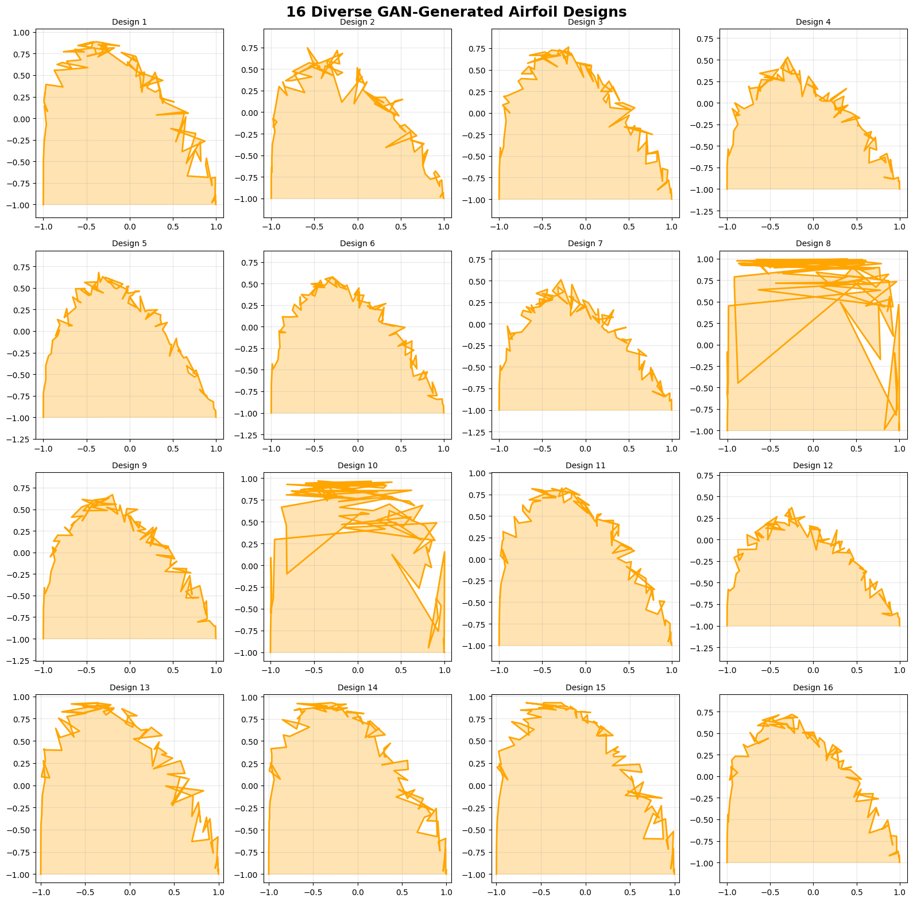
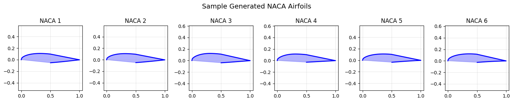
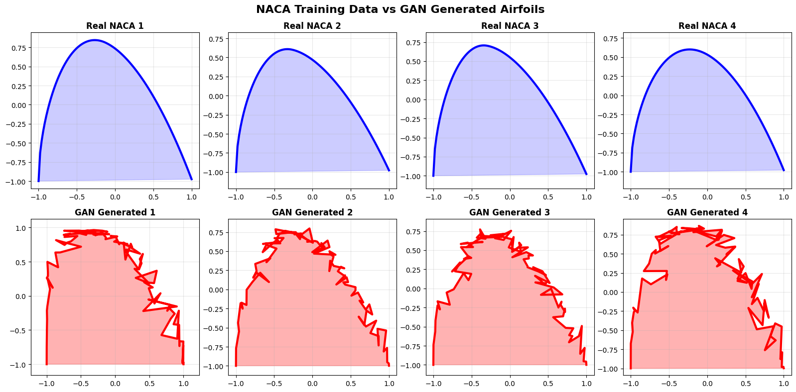
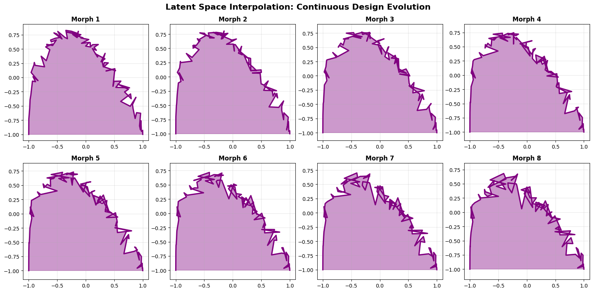
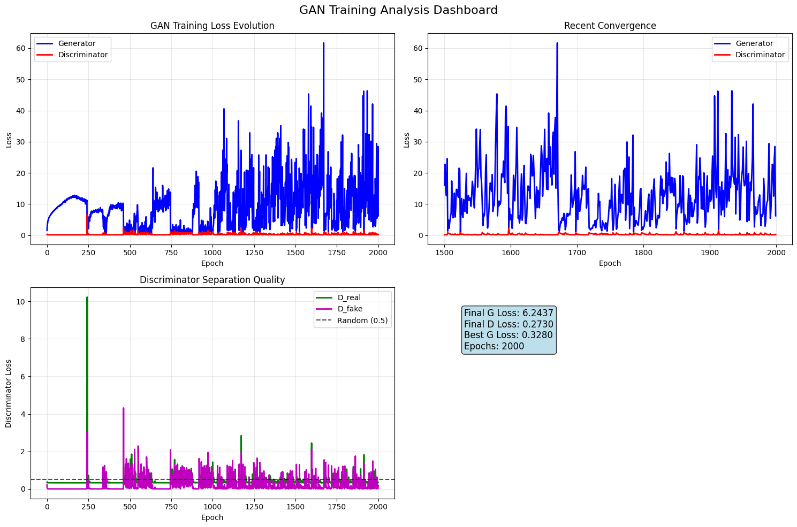
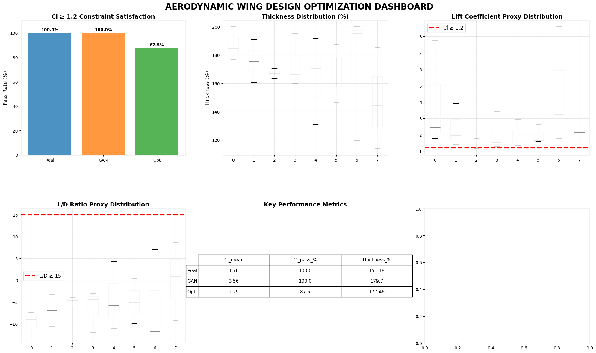
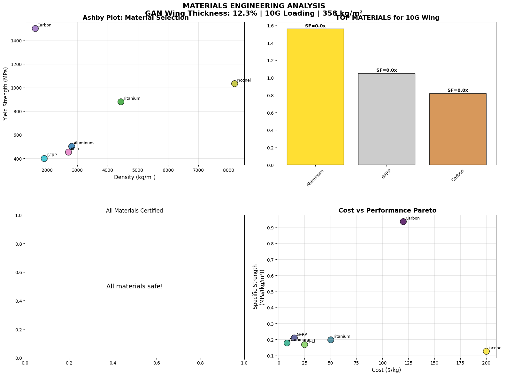
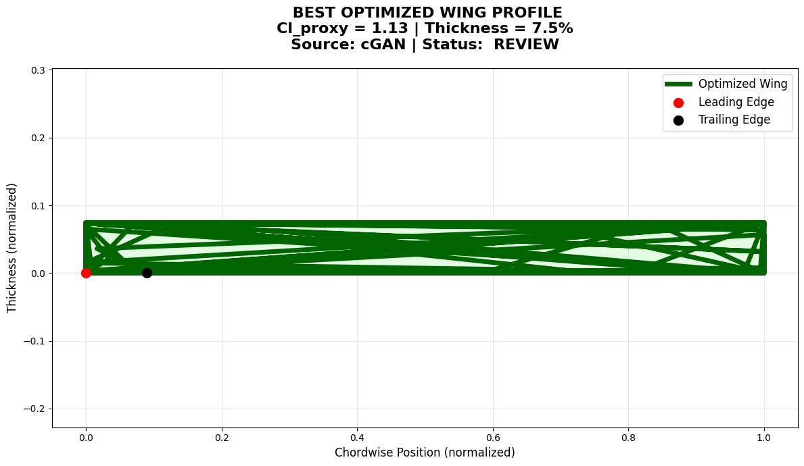

#  GAN Image Generation Project

##  Overview
This project implements Generative Adversarial Networks (GANs) to generate realistic images using deep learning.

##  Concepts Covered
- GAN (Generator & Discriminator)
- Deep Learning
- Image Generation
- Neural Networks

##  Tech Stack
- Python
- TensorFlow / PyTorch
- Jupyter Notebook

##  Files
- gan-image-generation.ipynb → Main notebook

##  How to Run
1. Open in Jupyter Notebook or Google Colab
2. Run all cells

##  Output
Generated images using GAN model.

##  Key Insight
GANs can learn data distribution and generate new realistic samples.

# GAN Image Generation

---

## Results & Visualizations

### Generated Airfoils

### Real vs GAN Comparison

### Design Exploration

### Latent Space Morphing

---

## Training Performance

---

## Analysis Dashboards

### Final Analysis

### Materials Visualization

### Best Design

---
 Star this repo if you like it!
